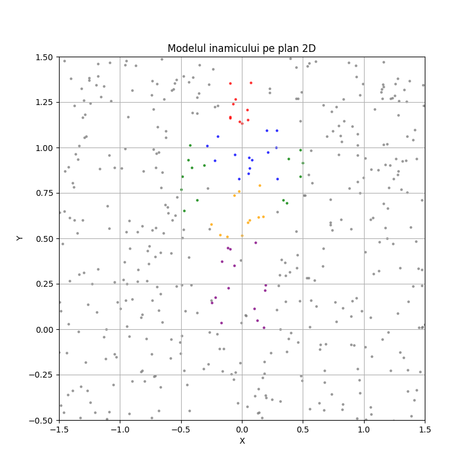

# Proiect Probabilități & Statistică 2024-2025
---
Video prezentare: https://youtu.be/Aj6E8oODAdw

### Componența echipei:
- Cotivă David
- Piele Vlăduț-Ștefan
- Roșianu Radu-Daniel

### Informații
Documentația proiectului se găsește in fișierul documentatie.pdf (in .md este Markdown cu Mathjax, de aceea Github nu îi dă render corect), iar scriptul in main.py.

